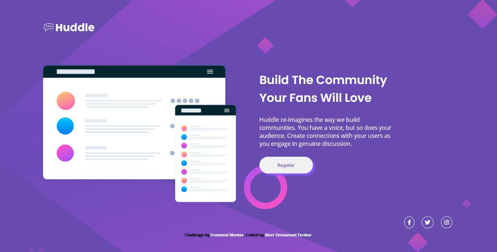

- [Overview](#overview)
  - [The challenge](#the-challenge)
  - [Screenshot](#screenshot)
  - [Links](#links)
- [My process](#my-process)
  - [Built with](#built-with)
  - [Continued development](#continued-development)
  - [Useful resources](#useful-resources)
- [Author](#author)

## Overview

### The challenge

- The project has been built to allow for mobile responsivesness.

### Screenshot

### Links

- Solution URL: [Add solution URL here](https://github.com/terdoo-mzer/Huddle-landing-page-with-single-introductory-section/blob/main/index.html)
- Live Site URL: [Add live site URL here](https://your-live-site-url.com)

## My process

### Built with

- Semantic HTML5 markup
- CSS custom properties
- CSS Grid

### Continued development

I plan to focus on developing my strengths in the use of CSS grid. I see there is a tonne of things to be done with grid.

### Useful resources

- [Resource 1](https://www.w3schools.com/css/css_grid.asp) - W3schools is a great resource for anyone looking to learn how to use css grid. It's simple to understand. I rate them 5*!

## Author

- Frontend Mentor - [@yourusername](https://www.frontendmentor.io/profile/Terdoo-tech)
